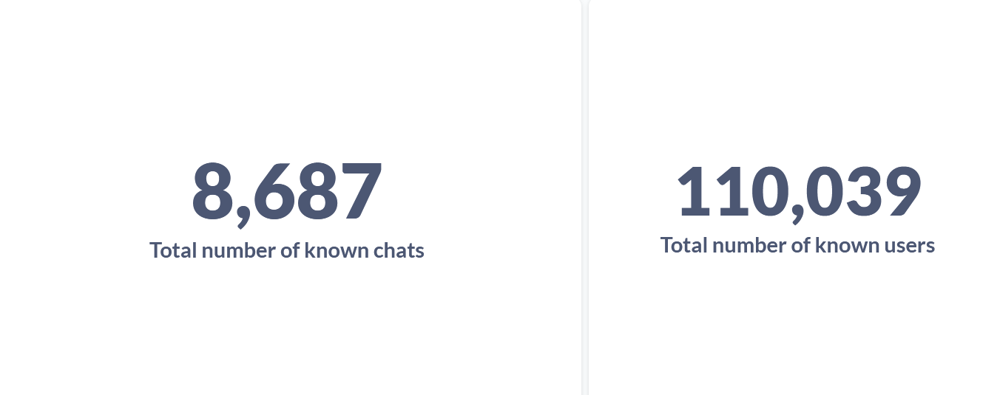

# familybot

Telegram Bot for my friends

Wake up Neo

You obosralsya

# Documentation

There are [docs](./DOCUMENTATION.md) now, check it out! They are not yet finished, but I am trying. Feel free to fix my
grammar or anything you would like to.

# Stats

Total amount of chats and users that have been seen by the bot:

Amount of everyday messages passed through the bot:

# Build & deploy

### Requirements

1. docker
2. docker compose

### Deploy

1. Fill environment variables in `scripts/.env`.

2. run `cd scripts && ./deploy.sh` and chose options you need

Run `./deploy.sh --help` if you need help.

# Disclaimer

This project may seem offensive. You have been warned. It was made just for fun, I don't have any negative feelings
towards anyone.
